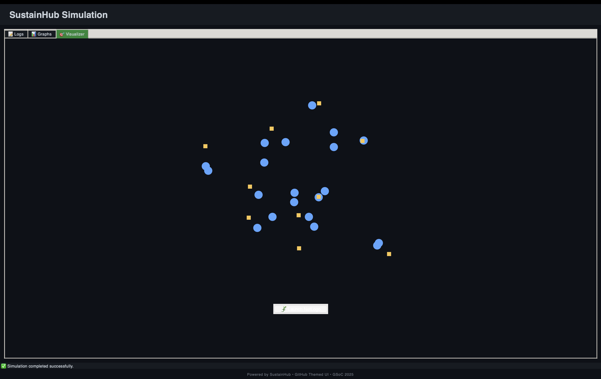

# SustainHub

**SustainHub** is a Reinforcement Learning–driven simulation framework for modeling, analyzing, and improving the sustainability of **open-source communities (OSS)**.  

The system captures realistic OSS dynamics using a **dual-layer reinforcement learning approach**:  
1. **Multi-Armed Bandits (MAB)** for global task allocation and role matching.  
2. **SARSA (State–Action–Reward–State–Action)** for local agent decision-making and task handling.  

Through this design, SustainHub provides insights into **fairness, adaptability, resilience, and efficiency** in collaborative communities.  

# Table of Contents

- [SustainHub File Structure](#sustainhub-file-structure)
- [1. Project Motivation](#1-project-motivation)
- [2. Objectives](#2-objectives)
- [3. Reinforcement Learning Framework](#3-reinforcement-learning-framework)
  - [3.1 Multi-Armed Bandits (MAB)](#31-multi-armed-bandits-mab)
  - [3.2 SARSA (State–Action–Reward–State–Action)](#32-sarsa-state–action–reward–state–action)
  - [3.3 Synergy of MAB and SARSA](#33-synergy-of-mab-and-sarsa)
- [4. Agents](#4-agents)
  - [4.1 Why these agents?](#why-these-agents)
- [5. Community Health Metrics](#5-community-health-metrics)
  - [5.1 Harmony Index (HI)](#51-harmony-index-hi)
  - [5.2 Resilience Quotient (RQ)](#52-resilience-quotient-rq)
  - [5.3 Reassignment Overhead (RO)](#53-reassignment-overhead-ro)
- [6. Graphical User Interface (GUI)](#6-graphical-user-interface-gui)
  - [6.1 Logs Tab](#61-logs-tab)
  - [6.2 Graphs Tab](#62-graphs-tab)
  - [6.3 Visualizer Tab](#63-visualizer-tab)
- [7. Simulation Controls](#7-simulation-controls)
- [8. How to Run](#8-how-to-run)
  - [8.1 Step 1: Fork the Repository](#step-1-fork-the-repository)
  - [8.2 Step 2: Clone the Repository](#step-2-clone-the-repository)
  - [8.3 Step 3: Navigate to the Project Directory](#step-3-navigate-to-the-project-directory)
  - [8.4 Step 4: Run the Simulation](#step-4-run-the-simulation)
    - [8.4.1 Option A: Run the GUI](#option-a-run-the-gui)
    - [8.4.2 Option B: Run inside the terminal](#option-b-run-inside-the-terminal)
  - [8.5 Output Data](#output-data)
- [9. Expected Output](#9-expected-output)
  - [9.1 Running with GUI (`gui.py`)](#a-running-with-gui-guipy)
  - [9.2 Running with Terminal (`main.py`)](#b-running-with-terminal-mainpy)
  - [9.3 Data Folder](#b-data-folder)
- [10. References](#10-references)
- [11. Contributor and Acknowledgements](#11-contributor-and-acknowledgements)
  - [11.1 Contributor](#contributor)
  - [11.2 Acknowledgements](#acknowledgements)


---
# SustainHub File Structure
```
SustainHub

┣ 📂agents
┃ ┣ 📜__init__.py
┃ ┣ 📜base_agent.py
┃ ┣ 📜contributor.py
┃ ┣ 📜innovator.py
┃ ┣ 📜knowledge_curator.py
┃ ┣ 📜maintainer.py
┃ ┗ 📜sarsa.py

┣ 📂simulation
┃ ┣ 📜__init__.py
┃ ┣ 📜metrics.py
┃ ┣ 📜persistence.py
┃ ┗ 📜simulation.py

┣ 📂tasks
┃ ┣ 📜__init__.py
┃ ┣ 📜bug_fix.py
┃ ┣ 📜docs.py
┃ ┣ 📜feature.py
┃ ┣ 📜generator.py
┃ ┗ 📜mab.py

┣ 📜README.md
┣ 📜graph.py
┣ 📜gui.py
┣ 📜main.py
┗ 📜netlogo_integration.py
```
---

## 1. Project Motivation

Open-source ecosystems rely on distributed collaboration, but they face sustainability challenges such as:  
- Uneven workload distribution leading to burnout.  
- Contributor dropouts and churn.  
- Inefficiencies in task allocation.  
- Knowledge silos reducing long-term engagement.  

SustainHub addresses these issues by simulating OSS communities as **agent-based models** that balance **efficiency (tasks completed)** and **sustainability (fairness, adaptability, inclusivity)**.  

---

## 2. Objectives

- Simulate realistic OSS task allocation and contributor behavior.  
- Balance **exploration (testing new contributors)** and **exploitation (using proven contributors)**.  
- Model individual learning and role specialization through SARSA.  
- Track community sustainability with **quantitative health metrics**.  
- Provide interactive experimentation through a GUI with simulation controls and visualizations.  

---

## 3. Reinforcement Learning Framework

### 3.1 Multi-Armed Bandits (MAB)

- **Role**: Used by the **Maintainer** to allocate tasks among available agents.  
- **Algorithm**: **Thompson Sampling** is applied to model the **exploration–exploitation tradeoff**.  
- **Mechanism**:  
  - Agents = levers in the bandit problem.  
  - Tasks = pulls on levers.  
  - Success/failure of task completion = observed reward.  

- **Benefits**:  
  - Ensures fairness by giving opportunities to less-used agents.  
  - Prevents stagnation by encouraging exploration.  
  - Adapts to evolving agent performance over time.  

---

### 3.2 SARSA (State–Action–Reward–State–Action)

- **Role**: Governs how individual agents respond to assigned tasks.  
- **Algorithm**: On-policy **Temporal Difference (TD) learning** method.  
- **State Representation**: Defined by  
  - Task type (bug, feature, documentation, other)  
  - Current workload (light, moderate, heavy)  
  - Historical success rate  

- **Actions**:  
  - Accept and attempt task.  
  - Skip task (idle).  
  - Attempt task outside specialization.  

- **Reward System**:  
  - +3 for success in specialized tasks.  
  - +1 for success in non-specialized tasks.  
  - 0 for skipping tasks.  
  - −1 for failed tasks.  

- **Advantages**:  
  - Encourages specialization while allowing flexibility.  
  - Penalizes idleness and failures.  
  - Models real OSS behavior where contributors adapt over time.  

---

### 3.3 Synergy of MAB and SARSA

- **MAB (Global Layer)**: Decides **who gets the task** based on role performance.  
- **SARSA (Local Layer)**: Decides **how the assigned agent responds** to the task.  

This layered reinforcement learning system ensures:  
- Fair global allocation of tasks.  
- Adaptive local agent learning and behavior refinement.  
- More realistic modeling of OSS collaboration.  

---

## 4. Agents

SustainHub models four specialized agent types, reflecting common OSS roles.  

| Agent Type        | Specialization                  | Reward (Success)     | Reward (Failure / Skip) |
|-------------------|---------------------------------|----------------------|--------------------------|
| **Maintainer**        | Allocates tasks using MAB        | Indirect via efficiency | — |
| **Contributor**       | Bug fixing and stability         | +3 (bugs), +1 (others) | −1 / 0 |
| **Innovator**         | Feature design and implementation| +3 (features), +1 (others) | −1 / 0 |
| **Knowledge Curator** | Documentation and knowledge mgmt | +3 (docs), +1 (others) | −1 / 0 |

### Why these agents?
- **Maintainer**: Ensures efficiency and fairness in task allocation.  
- **Contributor**: Keeps the project stable by resolving bugs.  
- **Innovator**: Drives growth by adding new features.  
- **Knowledge Curator**: Maintains documentation, ensuring accessibility and long-term engagement.  

Together, they capture the **division of labor and collaboration patterns** in OSS.  

---

## 5. Community Health Metrics

SustainHub introduces three quantitative metrics to measure sustainability:

### 5.1 Harmony Index (HI)
- **Purpose**: Captures workload balance and task success rate.  
- **Formula**:  
  \[
  HI = 0.6 * AvgSuccessRate + 0.4 * ( 1 / (1 + LoadVariance) )
  \]  
- **Range**: 0 (imbalanced) → 1 (perfect balance).  
- **Insight**: High HI indicates fairness and prevents burnout.  

---

### 5.2 Resilience Quotient (RQ)
- **Purpose**: Measures adaptability during disruptions (dropouts, workload spikes).  
- **Formula**:  
  \[
  RQ = 0.4 * TRE + 0.3 * SRR + 0.3 * HS
  \]  
  - TRE = Task Reallocation Efficiency  
  - SRR = Success Rate Recovery  
  - HS = Harmony Stability  

- **Range**: 0 (low) → 1 (high resilience).  
- **Insight**: High RQ = system can recover smoothly from disruptions.  

---

### 5.3 Reassignment Overhead (RO)
- **Purpose**: Tracks inefficiency caused by reassigning tasks.  
- **Formula**:  
  \[
 RO = ReassignedTasks / TotalTasksAssigned
  \]  
- **Range**: 0 (efficient) → 1 (highly inefficient).  
- **Insight**: Lower RO means effective first-time task allocation.  

---

## 6. Graphical User Interface (GUI)

Implemented in **Tkinter** with GitHub-inspired dark theme. Divided into three tabs:

### 6.1 Logs Tab
- Configure simulation parameters: steps, agents, tasks per step, dropouts per step.  
- Real-time textual logs in a terminal-like style.  
- Export logs as `.txt`.  

### 6.2 Graphs Tab
- Interactive performance graphs for **HI, RQ, and RO** using Matplotlib.  
- Export graphs as `.png` files.  
- Color-coded metrics for clarity.  

### 6.3 Visualizer Tab
- Agents visualized as **blue circles** and tasks as **yellow squares**.  
- Animated movements simulate task allocation and completion.  
- Optional **NetLogo integration** for advanced visualizations.  

  
You can see more in section 9
---

## 7. Simulation Controls

- **Tasks per Step**: Defines how many tasks are generated or assigned in each simulation step. This simulates workload variation and helps analyze how agents handle different levels of demand.  

- **Dropouts per Step**: Models contributor churn by removing a certain number of agents per step. This allows testing the system’s resilience when contributors leave.  

- **Number of Steps**: Specifies the total number of iterations the simulation will run. A higher number of steps allows long-term behavior and sustainability patterns to emerge.  

- **Number of Agents per Run**: Determines how many agents are initialized at the start of each simulation run. This affects collaboration dynamics and the diversity of agent strategies.  


These controls allow stress-testing of OSS dynamics under different conditions.    

---

## 8. How to Run

You can run SustainHub either through the **Graphical User Interface (GUI)** or directly via scripts.  
Follow the steps below based on your operating system.

---

### Step 1: Fork the Repository
1. Go to the [SustainHub GitHub repository](https://github.com/yourusername/sustainhub).  
2. Click on **Fork** (top-right) to create a copy under your GitHub account.  

---

### Step 2: Clone the Repository
**For macOS/Linux:**  
```bash
git clone https://github.com/<your-username>/sustainhub.git
cd GSoC/2025/SustainHub
```

**For macOS/Linux:** 
```bash
git clone https://github.com/<your-username>/sustainhub.git
cd GSoC\2025\SustainHub
```
---
### Step 3: Navigate to the Project Directory

Make sure you are inside the **SustainHub** folder:  

```bash
cd GSoC/2025/SustainHub
```
---

### Step 4: Run the Simulation

You can run **SustainHub** in two ways:  
1. Using the **Graphical User Interface (GUI)** (`gui.py`)  
2. Running the **Core Simulation Script** (`main.py`)  

---

#### Option A: Run the GUI

The GUI provides an interactive way to control the simulation.  

**For macOS/Linux:**  
```bash
python3 gui.py
```

**For Windows:**  
```bash
python gui.py
```

**A graphical interface will open, where you can control:**

- Number of tasks per step
- Dropouts per step
- Number of steps
- Number of agents per run

#### Option B: Run inside the terminal
The simulation will start running inside the terminal if you
**For macOS/Linux:**  
```bash
python3 main.py
```

**For Windows:**  
```bash
python main.py
```

- You will see **progress logs and metrics** printed step by step.  
- **Graphs** (e.g., sustainability index, agent performance) will **pop up automatically** using matplotlib.  
- Parameters such as **number of agents, steps, and dropout rates** need to be **manually edited inside `main.py`** before running.  

---

### Output Data

Regardless of whether you use `gui.py` or `main.py`:  

- A folder named **`data/`** is automatically created in the same directory.  
- Inside `data/`, you will find:  
  - **JSON files** → Storing learned **Q-values** from SARSA.  
  - **Image files (PNG/JPG)** → Generated graphs and visualizations from the simulation.  

This ensures your experimental results are stored for later analysis.  

## 9. Expected Output

When you run SustainHub, you should be able to see the following outputs depending on whether you use the **GUI** or **main.py (terminal mode)**.  
All screenshots and plots should be placed in the **`images/`** folder located in the same directory as `gui.py` and `main.py`.  

---

### A. Running with GUI (`gui.py`)

  

1. **Main GUI Window with Logs**  
     
   The above image just shows the Logs of step by step agents outputs.

2. **Three Graph Popups (Metrics)**  
   - Harmony Index    
  A good harmony index should have a value above 0.5 and a very good harmony index will be greater than 0.75 .
   - Resilience Quotient   
   A higher Resilience Quotient is better. 
   - Reassignment Overhead   
   Reassignment overhead when 1 means that all skipped tasks are being reassigned so it is good. 
   

3. **Graph Tab**  
     

4. **Visualizer Tab**  
     

---

### B. Running with Terminal (`main.py`)

1. **Terminal Output with Logs**  
     

2. **Success Heatmap**  
     

3. **Three Graphs (Metrics)**  
   - Harmony Index    
   - Resilience Quotient    
   - Reassignment Overhead    

### B. data folder
 - data  

**Note:** In terminal mode (`main.py`), there is **no visualization tab** and **parameters must be edited manually** in the code.  
**Note:** The above images are just sample images. Your actual output will differ but should be more or less the same.


## 10. References

Refer to the following paper for detailed insights into **SustainHub** and its design methodology:  
- [SustainHub Research Paper](link-to-paper)  


---

## 11. Contributor and Acknowledgements

### Contributor
- **Vidhi Rohira**  
  - [SustainHub Paper](link-to-paper)  
  - [Blog Posts](vidhirohira.github.io)  
  - [Email](rohiravidhi@gmail.com)  
  - [LinkedIn](https://www.linkedin.com/in/vidhi-rohira-435a22278/)  

---

### Acknowledgements
A heartfelt thank you to **[OREL – The Orthogonal Research and Education Laboratory](https://orthogonal-research.weebly.com/)** for making this project possible.  

Special thanks to my mentors for their tremendous guidance and support:  
- Bradly Alicea  
- Jesse Parent  
- Sarrah Bastawala  
- Mehul Arora  
- Morgan Hough  

Their mentorship and insights were invaluable in shaping SustainHub.  

# Note
If you have any doubts or queries feel free to reach out to Vidhi Rohira.
