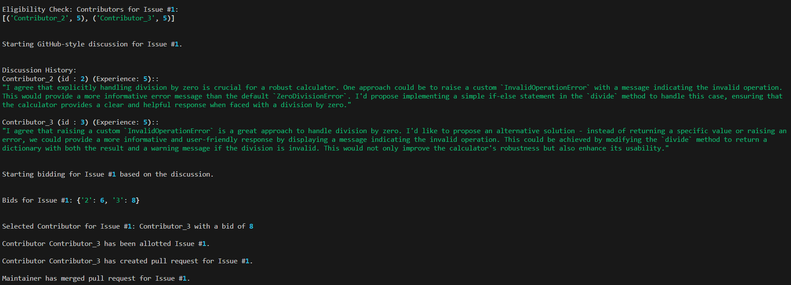

# Multi Agent Decision Making Algorithms 

## Overview

This folder contains two implementations of algorithms inspired by governance models used in open-source projects: the Benevolent Dictator Model and the Meritocratic Model. These models are simulated to assign issues to contributors within an open-source project using Large Language Models (LLMs).

### Benevolent Dictator Model (Authoritarian Algorithm)

The Benevolent Dictator Model is characterized by a single leader who steers the project, making decisions and guiding contributors. This model is exemplified by the Linux Kernel project led by Linus Torvalds. It requires strong leadership, deep technical knowledge, and community-building skills.

### Meritocratic Model (Decentralized Algorithm)

In the Meritocratic Model, participants gain influence based on their contributions. The Apache Software Foundation (ASF) exemplifies this model with its flat structure, allowing anyone to contribute and engage at any level.

## Implementation Approaches

### Authoritarian Algorithm (Benevolent Dictator Model)

This approach uses a central maintainer to manage and allocate tasks:

1. **Eligibility Check**: Maintainers filter contributors based on their availability and experience.
2. **Discussion**: Simulate a GitHub-style discussion among eligible contributors using LLMs.
3. **Rating**: Maintainer rates each contributor according to their comments in the github discussion and experience levels.
4. **Selection**: The contributor with highest rating from maintainer is selected.
5. **Task Allocation**: The selected contributor is assigned the task and simulates task completion.

### Decentralized Algorithm (Meritocratic Model)

This approach promotes a more democratic and open selection process:

1. **Eligibility Check**: Filters contributors based on their availability and experience.
2. **Discussion**: Simulate a GitHub-style discussion among eligible contributors using LLMs.
3. **Bidding**: Contributors bid on their suitability for the issue based on their own comment within the discussion and their experience levels .
4. **Selection**: The highest bidder is selected to work on the issue.
5. **Task Allocation**: The selected contributor is assigned the task and simulates task completion.

### Key Differences

- **Centralized Decision-Making**: In the authoritarian algorithm, a central maintainer guides and allocates tasks, while in the decentralized algorithm, contributors' bids determine task allocation.
- **Task Allocation**: The authoritarian model involves maintainers rating contributors, whereas the decentralized model selects contributors based on their highest bids.

### Key Common Features
- **Proportional Bidding / Rating**: The bid/rating is set according to the matching_level, which is the difference between {{contributor_role}} and {issue.difficulty}. If the matching_level is low, bid is high. If the matching_level is high, bid is very low. This helps to enocourage contributors to attempt tasks closer to their own potential.
- **Github**     


## Running the Algorithms

### Prerequisites

Ensure you have the required dependencies installed, including `langchain_community`, `numpy`, and any other necessary packages.

### Running the Authoritarian Algorithm

```sh
# Example usage for multiagent_authoritarian_algorithm.py
python multiagent_authoritarian_algorithm.py
```

Example output : 


### Running the Decentralized Algorithm

```sh
# Example usage for multiagent_decentralized_algorithm.py
python multiagent_decentralized_algorithm.py
```

Example output : 





These commands will execute the simulations, assigning issues to contributors according to the respective governance models.

## References 
- For [decentralized](https://python.langchain.com.cn/docs/use_cases/agent_simulations/multiagent_bidding) and [authoritarian](https://python.langchain.com.cn/docs/use_cases/agent_simulations/multiagent_authoritarian) algorithm approaches : [Langchain Use Cases : Agent Simulations](https://python.langchain.com.cn/docs/use_cases/agent_simulations/)
- For information about [benevelont-dictator](http://oss-watch.ac.uk/resources/benevolentdictatorgovernancemodel) and [meritocratic](http://oss-watch.ac.uk/resources/meritocraticgovernancemodel) open-source goverenance models : http://oss-watch.ac.uk/resources/ 
